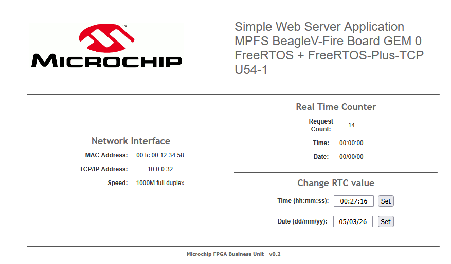

# Beagle V Fire PolarFire SoC Baremetal FreeRTOS

This started life as a copy of Microchip's mpfs-mac-mcc-stack and mpfs-uart-mac-freertos_lwip example projects from the
[polarfire-soc-bare-metal-examples](https://github.com/polarfire-soc/polarfire-soc-bare-metal-examples) repo.
It has been modified to use an updated FreeRTOS and use FreeRTOS-Plus-TCP instead of lwIP.

Code runs on the U54_1 hart.

## BeagleV-Fire GPIO Mapping

### User LEDs

```c
MSS_GPIO_init(GPIO2_LO);
MSS_GPIO_config(GPIO2_LO, MSS_GPIO_0,  MSS_GPIO_OUTPUT_MODE); // user LED 0
MSS_GPIO_config(GPIO2_LO, MSS_GPIO_1,  MSS_GPIO_OUTPUT_MODE); // user LED 1
MSS_GPIO_config(GPIO2_LO, MSS_GPIO_2,  MSS_GPIO_OUTPUT_MODE); // user LED 2
MSS_GPIO_config(GPIO2_LO, MSS_GPIO_3,  MSS_GPIO_OUTPUT_MODE); // user LED 3
MSS_GPIO_config(GPIO2_LO, MSS_GPIO_4,  MSS_GPIO_OUTPUT_MODE); // user LED 4
MSS_GPIO_config(GPIO2_LO, MSS_GPIO_5,  MSS_GPIO_OUTPUT_MODE); // user LED 5
MSS_GPIO_config(GPIO2_LO, MSS_GPIO_6,  MSS_GPIO_OUTPUT_MODE); // user LED 6
MSS_GPIO_config(GPIO2_LO, MSS_GPIO_7,  MSS_GPIO_OUTPUT_MODE); // user LED 7
MSS_GPIO_config(GPIO2_LO, MSS_GPIO_8,  MSS_GPIO_OUTPUT_MODE); // user LED 8
MSS_GPIO_config(GPIO2_LO, MSS_GPIO_9,  MSS_GPIO_OUTPUT_MODE); // user LED 9
MSS_GPIO_config(GPIO2_LO, MSS_GPIO_11, MSS_GPIO_OUTPUT_MODE); // user LED 11
```

### User Button
```c
uint32_t io0;
uint8_t btn;

MSS_GPIO_init(GPIO0_LO);
MSS_GPIO_config(GPIO0_LO, 13, MSS_GPIO_INPUT_MODE);

/* Loop until button is pressed */
do
{
    io0 = MSS_GPIO_get_inputs(GPIO0_LO);
    btn = (io0 >> 13) & 1;
    vTaskDelay(pdMS_TO_TICKS(500));
}
while(btn == 1);
```

## Middleware versions

| Library           | Version | Link                                                                                           |
|-------------------|---------|------------------------------------------------------------------------------------------------|
| BACnet Stack      | 1.4.2   | [https://github.com/bacnet-stack/bacnet-stack](https://github.com/bacnet-stack/bacnet-stack)   |
| FreeRTOS          | 11.1    | [https://github.com/FreeRTOS/FreeRTOS-Kernel](https://github.com/FreeRTOS/FreeRTOS-Kernel)     |
| FreeRTOS-Plus-TCP | 4.3.3   | [https://github.com/FreeRTOS/FreeRTOS-Plus-TCP](https://github.com/FreeRTOS/FreeRTOS-Plus-TCP) |

## FreeRTOS

### Trap Vector

Two steps were required to get FreeRTOS running correctly:

- use `freertos_trap_vector` instead of the default `trap_vector`
- amend the default empty `freertos_risc_v_application_interrupt_handler` to pass off to `trap_from_machine_mode`

#### `u54_1.c`

This is simple enough, we just set the machine trap vector as `freertos_risc_v_trap_handler`.

```C
__asm__ volatile ( "csrw mtvec, %0" : : "r" ( freertos_risc_v_trap_handler ) );
```

#### `FreeRTOS-Kernel/portable/GCC/RISC-V/portASM.S:283`

The `freertos_risc_v_trap_handler` passes non-timer interrupts to its application interrupt handler.
Out of the box it's an empty function, we just need to pass the execution to the mss `trap_from_machine_mode` function in `mms_mtrap.c`.

```assembly
freertos_risc_v_application_interrupt_handler:
    csrr t0, mcause     /* For viewing in the debugger only. */
    csrr t1, mepc       /* For viewing in the debugger only */
    csrr t2, mstatus    /* For viewing in the debugger only */

    # Invoke the handler.
    mv a0, sp                          # a0 <- regs
    # Please note: mtval is the newer name for register mbadaddr
    # If you get a compile failure here, use the newer name
    # At this point (2019), both are supported in latest compiler
    # older compiler versions only support mbadaddr, so going with this.
    # See: https://github.com/riscv/riscv-gcc/issues/133
    csrr a1, mbadaddr                 # useful for anaysis when things go wrong
    csrr a2, mepc
    j trap_from_machine_mode
```

## FreeRTOS-Plus-TCP

### Network Interface Port

A port layer was written to use the mss-ethernet-mac driver, see `src/middleware/FreeRTOS-Plus-TCP/source/portable/NetworkInterface/MPFS/NetworkInterface.c`.
For now it is a simple implementation, not a zero copy.

### DHCP Issue

The FreeRTOS_IP stack was dropping the incoming DHCP offer packet.
It will also drop the subsequent ack if the offer gets through.

Note that this only happens when `ipconfigETHERNET_DRIVER_FILTERS_PACKETS == 0`.

The stack trace of interest is:

- `prvProcessEthernetPacket`
- `prvProcessIPPacket`
- `prvAllowIPPacketIPv4`

 `prvAllowIPPacketIPv4` was dropping the DHCP offer here:

 ```C
 else if(
    ( FreeRTOS_FindEndPointOnIP_IPv4( ulDestinationIPAddress ) == NULL ) &&
    /* Is it an IPv4 broadcast address x.x.x.255 ? */
    ( ( FreeRTOS_ntohl( ulDestinationIPAddress ) & 0xffU ) != 0xffU ) &&
    ( xIsIPv4Multicast( ulDestinationIPAddress ) == pdFALSE ) )
{
    /* Packet is not for this node, release it */
    eReturn = eReleaseBuffer;
}
 
 ```

 and my solution is:

 ```C
 else if(
    ( FreeRTOS_FindEndPointOnIP_IPv4( ulDestinationIPAddress ) == NULL ) &&
    /* Is it an IPv4 broadcast address x.x.x.255 ? */
    ( ( FreeRTOS_ntohl( ulDestinationIPAddress ) & 0xffU ) != 0xffU ) &&
    ( xIsIPv4Multicast( ulDestinationIPAddress ) == pdFALSE ) )
{
    /* DHCP offer is made to the offered IP address, which we won't have set yet as
       the offer hasn't reached the DHCP state machine yet and not been requested and ack'd.
       Therefore it can get through the above checks and still be valid. */
    if( pxNetworkBuffer->pxEndPoint->bits.bWantDHCP == pdTRUE )
    {
        eDHCPState_t state = pxNetworkBuffer->pxEndPoint->xDHCPData.eDHCPState;
        if ( ( state != eWaitingOffer ) && ( state != eWaitingAcknowledge ) )
            eReturn = eReleaseBuffer;
    }
    else
    {
        /* Packet is not for this node, release it */
        eReturn = eReleaseBuffer;
    }
}
 ```

Note that this has been addressed by a pull request in the FreeRTOS-Plus-TCP repo, but it didn't make it into
the 4.3.3 release.

## FreeRTOS/FreeRTOS-Plus-TCP `printf` Messages

Custom macros were defined to pipe debug messages out over UART, specifically `g_mss_uart0_lo`,
so make sure that's configured before enabling the below.

`#define FREERTOS_IP_TRACE_ENABLE` to enable trace functionality defined in `FreeRTOSIPTraceMacroCustom.h`.

There are two config settings to enable debug messages in `FreeRTOSIPConfig.h`.

`#define ipconfigHAS_DEBUG_PRINTF ipconfigENABLE` on line 118.

`#define ipconfigHAS_PRINTF ipconfigENABLE` on line 148.

## Tasks

### Peripheral Example Tasks

Application tasks have been written to showcase I2C and SPI peripheral interfacing. Values are printed out via UART0.
See `src/application/common/application_tasks.c` for more.

The peripherals used are:

| Device                                      | Interface  | Link                                             |
|:--------------------------------------------|:-----------|:-------------------------------------------------|
| BME280 temperature/humidity/pressure sensor | I2C or SPI | [https://adafru.it/2652](https://adafru.it/2652) |
| DS3231 RTC                                  | I2C        | [https://adafru.it/3013](https://adafru.it/3013) |
| MCP3008 10-bit 8 channel ADC                | SPI        | [https://adafru.it/856](https://adafru.it/856)   |

These can be enabled by uncommenting the desired define at the top of `src/application/common/application_tasks.c`:

```c
/* enable peripherals as needed */
//#define SPI_USE_MCP3008
//#define I2C_USE_DS3231
//#define I2C_USE_BME280
```

Datasheets are located in `notes/`.

Example output with all three peripherals enabled:

```txt
RTC: Thursday, 2026/03/05 00:31:27

Temperature: 26.63 deg C
   Pressure: 96286.85 Pa
   Humidity: 42.589 %RH

ADC[0]: 0.0
ADC[1]: 0.5
ADC[2]: 0.0
ADC[3]: 0.5
ADC[4]: 0.5
ADC[5]: 0.0
ADC[6]: 0.0
ADC[7]: 0.0
```

#### Pinouts

SPI and I2C pins are in the P9 cape header, see [Beagle V documentation](https://docs.beagleboard.org/boards/beaglev/fire/01-introduction.html).

##### SPI 0

| Name | Cape Header Pin |
|:-----|:----------------|
| CLK  | P9_22           |
| SS1  | P9_17           |
| DO   | P9_18           |
| DI   | P9_21           |

##### I2C 0

| Name | Cape Header Pin |
|:-----|:----------------|
| SCL  | P9_19           |
| SDA  | P9_20           |

## Webserver Task

A sample webserver task is used to show TCP capabilities. Simply enter the device's IP in your browser.



The RTC functionality is disabled, but can be enabled by using the mss-rtc driver. Requests are sent every 500ms.

### BACnet Task

A sample BACnet client task is used to show UDP capabilities.
Use a BACnet explorer such as YABE to find the device on the local network.

### Blinky Task

A simple blinky task is used to show the current network status of the device.
On start, the user LED will flash every 250ms and then this changes to 1000ms once the network has come up.
